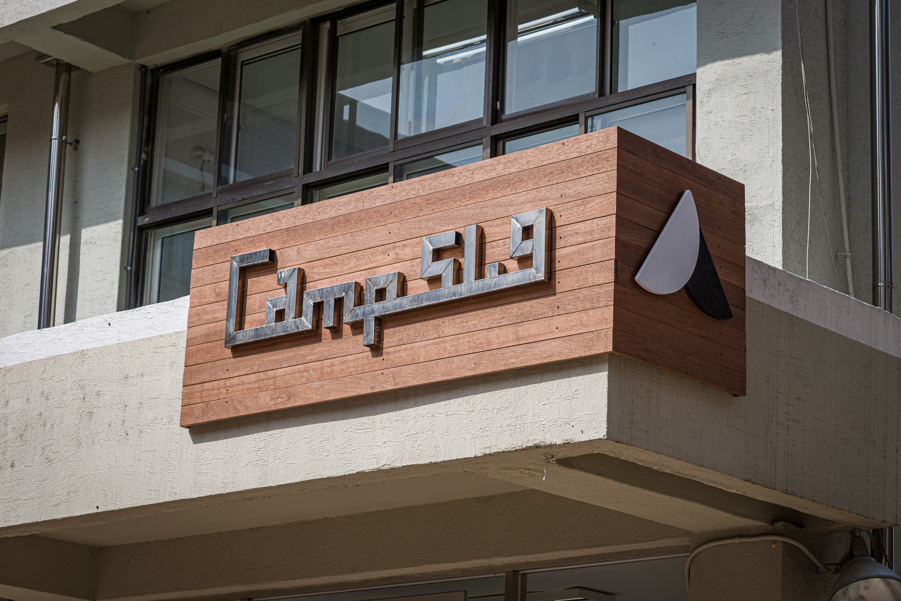
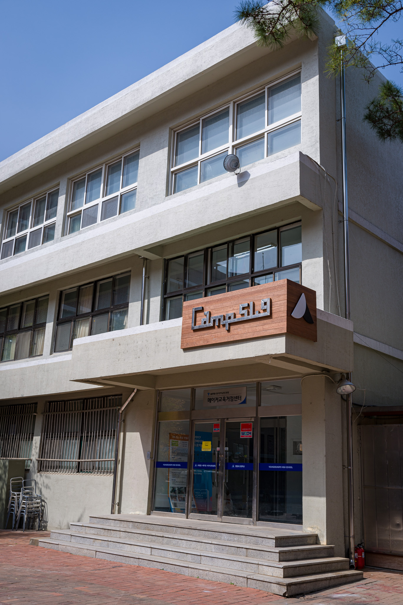

## [Camp 51.9] Project(2) 

프로젝트 기간 : 2021.03.17 ~ 


## Camp 51.9 간판 조명 설치

 영등포고등학교 메이커스페이스 Camp51.9가 드디어 간판을 달았습니다!!!                                                              



이제 어두운 밤 간판을 빛춰줄 조명을 설치할려고 합니다. 

### 하드웨어

##### 3D 모델링

조명을 달기 앞서 먼저 모델링을 했습니다. 저에게 반년간 모델링과 여러 가지들을 전수하시고 입대를 하신 전 매니저님의 간판 모델링을 이어받아 모델링 하였습니다.

<video src="사진/모델링 50.mp4"></video>

 

##### 아두이노 회로

간판에 불을 키고 끄는 과정을 어두워지는 시간에 맞춰 작동하게 만들기 위해 시간을 재주는 RTC 모듈을 사용했고 12v LED 바를 켯다 끄기 위해 릴레이 모듈을 사용했습니다.


### 소프트웨어

월 별 밖이 어두워지는 시간에 맞춰 릴레이를 HIGH/LOW 해줍니다.

```c++
#include <core_build_options.h>
#include <swRTC.h>

swRTC rtc;  //클래스 개체 선언
int relay = 9;

void setup() {
  rtc.stopRTC();            //정지
  rtc.setTime(19, 6, 0);  //시, 분, 초
  rtc.setDate(27, 3, 2021); //일, 월, 년
  rtc.startRTC();           //시작
  Serial.begin(57600);

  pinMode (relay, OUTPUT); 
  //digitalWrite (relay, LOW);
  //digitalWrite (relay, HIGH);
}

void loop() {
  Serial.print(rtc.getHours(), DEC);
  Serial.print(":");
  Serial.print(rtc.getMinutes(), DEC);
  Serial.print(":");
  Serial.print(rtc.getSeconds(), DEC);
  Serial.print(" "); 

  Serial.print(rtc.getYear(), DEC);
  Serial.print("/");
  Serial.print(rtc.getMonth(), DEC);
  Serial.print("/");
  Serial.println(rtc.getDay(), DEC);
  delay(1000);

  
  
  switch(rtc.getMonth()){
    case 1:   //1월
    if(rtc.getHours() == 18 && rtc.getMinutes() == 0){
      //digitalWrite (relay, HIGH);
      Serial.print("간판 불이 켜졌습니다.\n");
      digitalWrite (relay, LOW);
    }
    if(rtc.getHours() == 21 && rtc.getMinutes() == 0){
      digitalWrite (relay, HIGH);
      //digitalWrite (relay, LOW);
      Serial.print("간판 불이 꺼졌습니다.\n");
    }
    break;
    case 2:   //2월
    if(rtc.getHours() == 18 && rtc.getMinutes() == 37){
      digitalWrite (relay, HIGH);
      Serial.print("간판 불이 켜졌습니다.\n"); 
      //digitalWrite (relay, LOW);
    }
    if(rtc.getHours() == 21 && rtc.getMinutes() == 0){
      //digitalWrite (relay, HIGH);
      digitalWrite (relay, LOW);
      Serial.print("간판 불이 꺼졌습니다.\n");
    }
    break;
    case 3:   //3월
    if(rtc.getHours() == 18 && rtc.getMinutes() == 58){
      //digitalWrite (relay, HIGH);
      Serial.print("간판 불이 켜졌습니다.\n");
      digitalWrite (relay, LOW);
    }
    if(rtc.getHours() == 21 && rtc.getMinutes() == 0){
      digitalWrite (relay, HIGH);
      //digitalWrite (relay, LOW);
      Serial.print("간판 불이 꺼졌습니다.\n");
    }
    break;
    case 4:   //4월
    if(rtc.getHours() == 19 && rtc.getMinutes() == 12){
      //digitalWrite (relay, HIGH);
      Serial.print("간판 불이 켜졌습니다.\n");
      digitalWrite (relay, LOW);
    }
    if(rtc.getHours() == 21 && rtc.getMinutes() == 0){
      digitalWrite (relay, HIGH);
      //digitalWrite (relay, LOW);
      Serial.print("간판 불이 꺼졌습니다.\n"); 
    }
    break;
    case 5:   //5월
    if(rtc.getHours() == 19 && rtc.getMinutes() == 52){
      //digitalWrite (relay, HIGH);
      Serial.print("간판 불이 켜졌습니다.\n");
      digitalWrite (relay, LOW);
    }
    if(rtc.getHours() == 21 && rtc.getMinutes() == 0){
      digitalWrite (relay, HIGH);
      //digitalWrite (relay, LOW);
      Serial.print("간판 불이 꺼졌습니다.\n"); 
    }
    break;
    case 6:   //6월
    if(rtc.getHours() == 20 && rtc.getMinutes() == 15){
      //digitalWrite (relay, HIGH);
      Serial.print("간판 불이 켜졌습니다.\n");
      digitalWrite (relay, LOW);
    }
    if(rtc.getHours() == 21 && rtc.getMinutes() == 0){
      digitalWrite (relay, HIGH);
      //digitalWrite (relay, LOW);
      Serial.print("간판 불이 꺼졌습니다.\n"); 
    }
    break;
    case 7:   //7월
    if(rtc.getHours() == 20 && rtc.getMinutes() == 20){
      //digitalWrite (relay, HIGH);
      Serial.print("간판 불이 켜졌습니다.\n");
      digitalWrite (relay, LOW);
    }
    if(rtc.getHours() == 21 && rtc.getMinutes() == 0){
      digitalWrite (relay, HIGH);
      //digitalWrite (relay, LOW);
      Serial.print("간판 불이 꺼졌습니다.\n"); 
    }
    break;
    case 8:   //8월
    if(rtc.getHours() == 19 && rtc.getMinutes() == 56){
      //digitalWrite (relay, HIGH);
      Serial.print("간판 불이 켜졌습니다.\n"); 
      digitalWrite (relay, LOW);
    }
    if(rtc.getHours() == 21 && rtc.getMinutes() == 0){
      digitalWrite (relay, HIGH);
      //digitalWrite (relay, LOW);
      Serial.print("간판 불이 꺼졌습니다.\n");
    }
    break;
    case 9:   //9월
    if(rtc.getHours() == 19 && rtc.getMinutes() == 15){
      //digitalWrite (relay, HIGH);
      Serial.print("간판 불이 켜졌습니다.\n"); 
      digitalWrite (relay, LOW);
    }
    if(rtc.getHours() == 21 && rtc.getMinutes() == 0){
      digitalWrite (relay, HIGH);
      //digitalWrite (relay, LOW);
      Serial.print("간판 불이 꺼졌습니다.\n"); 
    }
    break;
    case 10:    //10월
    if(rtc.getHours() == 18 && rtc.getMinutes() == 30){
      //digitalWrite (relay, HIGH);
      Serial.print("간판 불이 켜졌습니다.\n"); 
      digitalWrite (relay, LOW);
    }
    if(rtc.getHours() == 21 && rtc.getMinutes() == 0){
      digitalWrite (relay, HIGH);
      //digitalWrite (relay, LOW);
      Serial.print("간판 불이 꺼졌습니다.\n"); 
    }
    break;
    case 11:   //11월
    if(rtc.getHours() == 18 && rtc.getMinutes() == 57){
      //digitalWrite (relay, HIGH);
      Serial.print("간판 불이 켜졌습니다.\n"); 
      digitalWrite (relay, LOW);
    }
    if(rtc.getHours() == 21 && rtc.getMinutes() == 0){
      digitalWrite (relay, HIGH);
      //digitalWrite (relay, LOW);
      Serial.print("간판 불이 꺼졌습니다.\n"); 
    }
    break;
    case 12:    //12월
    if(rtc.getHours() == 17 && rtc.getMinutes() == 48){
      //digitalWrite (relay, HIGH);
      Serial.print("간판 불이 켜졌습니다.\n"); 
      digitalWrite (relay, LOW);
    }
    if(rtc.getHours() == 21 && rtc.getMinutes() == 0){
      digitalWrite (relay, HIGH);
      //digitalWrite (relay, LOW);
      Serial.print("간판 불이 꺼졌습니다.\n");
    }
    break;
  }
}
```

#### 제작

제작중...